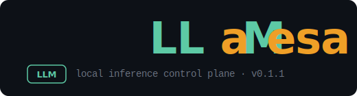

# LLaMesa — local inference control plane

<div align="center">



<br />

<sup><span style="color:#6b7280;">LLaMesa = LLM + "lamesa" (table in Filipino)</span></sup>

</div>

---

## What is this?

LLaMesa is a **terminal-based control plane** for managing a remote [llama.cpp](https://github.com/ggml-org/llama.cpp) inference server running on **Bazzite Linux**. Think of it as a cockpit for your home lab LLM rig — all from your Windows PowerShell.

You run the client on Windows. It SSHs into your Bazzite machine and tells your AMD GPU what to do. No web UI, no browser tabs, just clean terminal vibes.

### The name

**LLaMesa** = **LL** + **a** + **M** + **esa** — a pun on LLM + *"lamesa"* (table in Filipino). Your table of models, right at your fingertips.

## Features

- 🚀 **One-command startup** — pick a model, set thinking mode, context size, done
- 📊 **Live stats dashboard** — VRAM, GPU%, CPU%, RAM updating every 2 seconds
- 🧠 **Thinking mode support** — toggle extended thinking on/off per session
- 🔄 **Hot-swap models** — switch between models without full restart
- 💬 **Built-in chat** — stream responses token-by-token right in your terminal
- ⬇️ **Model downloads** — pull from HuggingFace without leaving the client
- 🖼️ **Multimodal detection** — auto-detects mmproj files for vision models
- 🖥️ **Multi-server profiles** — manage multiple Bazzite rigs from one client
- 🎨 **Color-coded health** — green/yellow/red indicators so you know when things are cooking

## Quick Start

### On Bazzite (server)

```bash
# First-time setup — answers a few questions, writes config
git clone https://github.com/martinongtangco/llamesa.git
cd llamesa
bash install.sh
```

### On Windows (client)

```powershell
# Make sure SSH keys are set up (see docs/windows-setup.md)
pwsh -File client/llamesa.ps1
```

### Then just...

```
/select a model → /start → watch it fire up → /chat → profit
```

## How It Works

```
┌──────────────┐  SSH  ┌─────────────────────────────────┐
│   Windows    │ ────▶ │     Bazzite Linux               │
│              │       │                                  │
│  llamesa.ps1 │       │  llamesa.sh                      │
│  (client)    │       │  ─────────                       │
│              │       │  Manages llama-server in         │
│  Pick model  │       │  distrobox container             │
│  View stats  │       │                                  │
│  Chat stream │       │  Your AMD GPU does the heavy     │
│              │       │  lifting with Vulkan + ROCm      │
└──────────────┘       └─────────────────────────────────┘
```

## Prerequisites

| Component | Requirement |
|-----------|-------------|
| **Server OS** | Bazzite Linux (Steam OS fork) |
| **GPU** | AMD RDNA2+ (RDNA4 needs Mesa 25+) |
| **Container** | distrobox with Ubuntu 22.04 |
| **Inference** | llama.cpp built with Vulkan backend |
| **Windows** | PowerShell 7 + OpenSSH Client |
| **Network** | SSH keys (password auth will break stats refresh) |

Full setup guides: [Bazzite](docs/bazzite-setup.md) · [Windows](docs/windows-setup.md)

## Commands

| Command | What it does |
|---------|-------------|
| `/start` | Start server — pick model, thinking mode, context size |
| `/stop` | Graceful shutdown |
| `/switch` | Hot-swap to a different model |
| `/restart` | Stop + start with same settings |
| `/stats` | Live stats dashboard with scrolling logs |
| `/health` | Ping `/health` and `/v1/models` endpoints |
| `/logs` | Stream verbose server output |
| `/models` | List downloaded models with sizes |
| `/download` | Download from HuggingFace |
| `/chat` | Chat with the model directly |
| `/servers` | Manage server profiles |
| `/config` | View/edit config |
| `/quit` | Exit |

## Config

Server config lives at `~/.llamesa/config.json` on Bazzite:

```json
{
  "models_dir": "/var/mnt/games/models",
  "llama_binary": "/run/host/home/user/llama.cpp/build/bin/llama-server",
  "distrobox_container": "rocm-r9700",
  "default_context": 131072,
  "default_gpu_layers": 99,
  "default_thinking": true,
  "port": 1234
}
```

Client config lives at `~/.llamesa/config.json` on Windows — see [config/client.example.json](config/client.example.json).

## License

MIT — do whatever you want with it. See [LICENSE](LICENSE).

---

<div align="center">

**Built for home labbers who prefer terminals to dashboards.**

*Your VRAM is your oyster.* 🦪

</div>