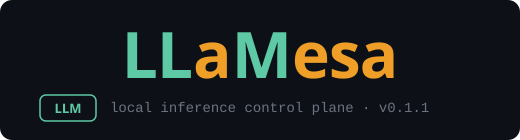

# LLaMesa — local inference control plane

<div align="center">



<br />

<sup><span style="color:#6b7280;">LLaMesa = LLM + "lamesa" (table in Filipino)</span></sup>

</div>

---

## What is this?

LLaMesa is a **terminal-based control plane** for managing a remote [llama.cpp](https://github.com/ggml-org/llama.cpp) inference server running on **Bazzite Linux**. Think of it as a cockpit for your home lab LLM rig — all from your Windows PowerShell.

You run the client on Windows. It SSHs into your Bazzite machine and tells your AMD GPU what to do. No web UI, no browser tabs, just clean terminal vibes.

### The name

**LLaMesa** = **LL** + **a** + **M** + **esa** — a pun on LLM + *"lamesa"* (table in Filipino). Your table of models, right at your fingertips.

## Features

- ⌨️ **Command palette** — press `/` for an arrow-key, live-filtering command menu; the chat input stays fixed at the bottom, always ready
- 🚀 **GPU-aware startup** — `/start` picks 1 or more models: 1 loads across all GPUs (combined VRAM), one-per-GPU loads a model on each
- 📊 **Live stats dashboard** — VRAM, GPU%, RAM, CPU auto-refreshing every 2 seconds, no keypress needed
- 🧠 **Thinking mode support** — toggle extended thinking on/off with `/think` and `/nothink`
- 🔄 **Hot-swap models** — run `/start` again and the server stops the old model for you
- 💬 **Chat is the default** — just type and hit enter, no separate chat mode; responses stream token-by-token
- ⬇️ **Model downloads** — pull from HuggingFace without leaving the client
- 🖼️ **Multimodal detection** — auto-detects mmproj files for vision models
- 🖥️ **Multi-server profiles** — manage multiple Bazzite rigs from one client
- 🎨 **Color-coded health** — green/yellow/red indicators so you know when things are cooking

## Quick Start

### On Bazzite (server)

```bash
# First-time setup — answers a few questions, writes config
git clone https://github.com/martinongtangco/llamesa.git
cd llamesa
bash install.sh
```

### On Windows (client)

```powershell
# Make sure SSH keys are set up (see docs/windows-setup.md)
pwsh -File client/llamesa.ps1
```

### Then just...

```
press / → /start → pick a model (or two, one per GPU) → watch it fire up → just start typing
```

## How It Works

```
┌──────────────┐  SSH  ┌─────────────────────────────────┐
│   Windows    │ ────▶ │     Bazzite Linux               │
│              │       │                                  │
│  llamesa.ps1 │       │  llamesa.sh                      │
│  (client)    │       │  ─────────                       │
│              │       │  Manages llama-server in         │
│  Pick model  │       │  distrobox container             │
│  View stats  │       │                                  │
│  Chat stream │       │  Your AMD GPU does the heavy     │
│              │       │  lifting with Vulkan + ROCm      │
└──────────────┘       └─────────────────────────────────┘
```

## Prerequisites

| Component | Requirement |
|-----------|-------------|
| **Server OS** | Bazzite Linux (Steam OS fork) |
| **GPU** | AMD RDNA2+ (RDNA4 needs Mesa 25+) |
| **Container** | distrobox with Ubuntu 22.04 |
| **Inference** | llama.cpp built with Vulkan backend |
| **Windows** | PowerShell 7 + OpenSSH Client |
| **Network** | SSH keys (password auth will break stats refresh) |

Full setup guides: [Bazzite](docs/bazzite-setup.md) · [Windows](docs/windows-setup.md) · [Picking a quant](docs/quantization.md) · [Picking a model](docs/model-selection.md)

## Commands

Press `/` any time to open the command palette — arrow keys to navigate, type
to filter, enter to run. The dashboard (VRAM/GPU/RAM/CPU) is always on screen
and refreshes on its own every 2 seconds; the input at the bottom is always a
chat box unless you're running a command with it.

| Command | What it does |
|---------|-------------|
| `/start` | Start server — pick 1 model (loads across all GPUs) or one per GPU, thinking mode, context size |
| `/stop` | Stop what's running — no prompt if only one thing is loaded |
| `/restart` | Stop + start with the same settings |
| `/health` | Ping `/health` and `/v1/models` endpoints |
| `/logs` | Stream verbose server output |
| `/models` | List downloaded models with sizes |
| `/download` | Download from HuggingFace |
| `/clear` | Clear chat history |
| `/think` / `/nothink` | Toggle thinking mode |
| `/servers` | Manage server profiles |
| `/config` | View/edit config |
| `/quit` | Exit |

To chat, just type — no `/` needed — and hit enter.

## Config

Server config lives at `~/.llamesa/config.json` on Bazzite:

```json
{
  "models_dir": "/var/mnt/games/models",
  "llama_binary": "/run/host/home/user/llama.cpp/build/bin/llama-server",
  "distrobox_container": "rocm-r9700",
  "default_context": 131072,
  "default_gpu_layers": 99,
  "default_thinking": true,
  "port": 1234,

  "flash_attn": "on",
  "cache_type_k": "q8_0",
  "cache_type_v": "q8_0"
}
```

The last three are optional — they quantise the KV cache, which roughly halves
what context costs in VRAM and is usually what decides whether a model fits on
one GPU or needs a cross-GPU split. See [docs/quantization.md](docs/quantization.md).

Client config lives at `~/.llamesa/config.json` on Windows — see [config/client.example.json](config/client.example.json).

## License

MIT — do whatever you want with it. See [LICENSE](LICENSE).

---

<div align="center">

**Built for home labbers who prefer terminals to dashboards.**

*Your VRAM is your oyster.* 🦪

</div>